# Hi 👋, I'm Sundhareshan

### Front-End Developer | React.js | JavaScript | UI/UX

I'm a **Computer Science Engineer and Front-End Developer** passionate about building responsive, user-friendly, and scalable web applications.

Currently working as a **Front-End Developer at Ashok Leyland**, deputed through Hinduja Tech Limited, with experience in web application development, API integration, application support, debugging, testing, and deployment.

---

## 👨‍💻 About Me

* 💼 **Front-End Developer**
* ⚛️ Specialized in **React.js & JavaScript**
* 🎨 Interested in **UI/UX Design**
* 🔗 Experience with **REST API Integration**
* 🛠️ Application Development & Maintenance
* 🐞 Debugging & Production Support
* 🚀 Application Deployment
* 📋 Requirement Gathering
* 🌱 Always learning and improving my development skills

---

## 🛠️ Tech Stack

### Frontend

### Backend & APIs

### Design

### Tools

---

## 🚀 Featured Projects

### 🏢 Application Lifecycle Management — Ashok Leyland

A unified **Application Lifecycle Management (ALM)** platform developed for Ashok Leyland.

**Highlights:**

* Responsive and persona-based dashboards
* Application lifecycle management
* Requirement and project tracking
* Integration with multiple development tools
* End-to-end traceability across the development lifecycle

> **Tech:** React.js • SCSS • TypeScript • REST APIs

---

### 👥 HRMS — Human Resource Management System

A web-based **Human Resource Management System** designed to manage employee-related processes and information.

**Features:**

* Employee management
* Attendance management
* Payroll management
* Dashboard
* Authentication
* Profile management

> **Tech:** React.js • TypeScript • REST APIs

🔗 **Repository:** [haztech-hrms](https://github.com/Sundar8506/haztech-hrms)

---

### 🛒 E-Commerce Website

A responsive e-commerce website focused on providing a clean and user-friendly shopping experience.

**Features:**

* Product listing
* Product categories
* Responsive design
* User-friendly interface

> **Tech:** JavaScript • HTML • CSS

🔗 **Repository:** [E-commerce](https://github.com/Sundar8506/E-commerce)

---

### 🎨 E-Commerce UI/UX Design

A clothing e-commerce interface designed with a focus on **modern UI/UX and responsive layouts**.

**Focus:**

* User experience
* Product presentation
* Category navigation
* Responsive design
* Checkout experience

🔗 **Repository:** [E-Commerce-Figma](https://github.com/Sundar8506/E-Commerce-Figma)

---

### 📝 Attendance Alert System

A project designed to manage attendance-related information and provide attendance alerts.

> **Tech:** JavaScript

🔗 **Repository:** [Attendance-alert](https://github.com/Sundar8506/Attendance-alert)

---

### 😀 Emoji Search

A simple web application that allows users to search and find emojis easily.

> **Tech:** JavaScript

🔗 **Repository:** [emojisearch](https://github.com/Sundar8506/emojisearch)

---

### 🌐 Personal Portfolio

My personal developer portfolio showcasing my skills, projects, experience, and work.

> **Tech:** JavaScript • HTML • CSS

🔗 **Repository:** [Portfolio](https://github.com/Sundar8506/Portfolio)

🌐 **Live Portfolio:** [sundhareshanportfolio.netlify.app](https://sundhareshanportfolio.netlify.app)

---

## 💼 Professional Experience

### Front-End Developer — Ashok Leyland

**Apr 2026 – Present**

Working on application support and enhancement, developing and enhancing web applications, resolving bugs and production issues, supporting testing and releases, gathering requirements, implementing business-driven features, and managing application deployments.

### Front-End Developer — Hinduja Tech Limited

**Sep 2025 – Apr 2026**

Worked on a unified ALM platform for Ashok Leyland, developing responsive dashboards and integrating APIs to provide end-to-end traceability across the application lifecycle.

---

## 🎓 Education

**B.E. Computer Science and Engineering**
Mount Zion College of Engineering and Technology

**CGPA: 7.86**

---

## 📊 GitHub Stats

  
  

---

## 🤝 Connect With Me

💼 **LinkedIn:**
https://www.linkedin.com/in/sundar8506/

🌐 **Portfolio:**
https://sundhareshanportfolio.netlify.app/

💻 **GitHub:**
https://github.com/Sundar8506

📧 **Email:**
[sundareshan140@gmail.com](mailto:sundareshan140@gmail.com)

---

### ⭐ Thanks for visiting my profile!

**Let's build something amazing together 🚀**
